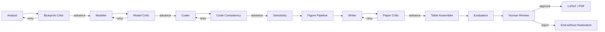

<p align="center">
  <strong>automcm-pro</strong>
</p>

<h1 align="center">automcm-pro</h1>
<h3 align="center">Lighting the path for every math modeling student.</h3>

<p align="center">
  <a href="#quick-start"><strong>Quick Start</strong></a> ·
  <a href="#how-it-works"><strong>How It Works</strong></a> ·
  <a href="#web-ui"><strong>Web UI</strong></a> ·
  <a href="#cli"><strong>CLI</strong></a> ·
  <a href="#project-structure"><strong>Structure</strong></a> ·
  <a href="#configuration"><strong>Configuration</strong></a>
</p>

<p align="center">
  
  
  
  
  
</p>

---

## What is automcm-pro?

automcm-pro is an **end-to-end math modeling automation system** built for students competing in MCM/ICM, GMCM (China Graduate Mathematical Contest in Modeling), and similar contests. Given a competition problem, it orchestrates a multi-agent LangGraph pipeline to analyze the problem, build models, write and execute code, generate figures, produce a complete paper, and compile it to PDF — all with **human-in-the-loop review** at key checkpoints.

> **定位**：把原始赛题转化为可审计的模型、实验、图表和论文。

---

## Quick Start

### Prerequisites

- **Python 3.11–3.13** — 用于后端智能体流水线
- **Node.js ≥ 18** — for the Web UI server
- **uv** — Python package manager ([install](https://docs.astral.sh/uv/getting-started/installation/))
- An **LLM API endpoint** (OpenAI-compatible) — your router, proxy, or cloud provider

### One-command launch

```bash
# Clone
git clone <your-repository-url>
cd automcm-pro

# Install dependencies and create a local .env
powershell -ExecutionPolicy Bypass -File .\scripts\setup.ps1

# Launch the recommended supervised WebUI
npm run start:framework
```

Open the URL printed by the launcher, normally **http://127.0.0.1:5174/**. The launcher reuses an
existing supervised service or selects a free port when 5174 is occupied. The setup script never
overwrites an existing `.env`; enter the API endpoint, model and key through the WebUI settings.
For the legacy/full LangGraph WebUI, use `npm start` after setup.

---

## How It Works

automcm-pro 使用 **LangGraph** 编排 14 个用户可见阶段（另含内部阶段切换节点）：



| Node | Role |
|------|------|
| **Analyst / Blueprint Critic** | 结构化拆题并审查小问、变量、目标、约束与验证计划 |
| **Modeler / Model Critic** | 按 basic → improved → final 建模，并检查假设与推导 |
| **Coder / Code Consistency** | 生成可执行实验代码，并核对模型、代码和输出指标 |
| **Sensitivity** | 执行参数扫描与鲁棒性分析 |
| **Figure Pipeline** | 收集图像，执行多模态质量评审并生成“结论—证据—含义—边界”式图说 |
| **Writer / Paper Critic** | 按章节写作，并在评审反馈下定向重写 |
| **Table Assembler** | 从结构化结果生成表格，并对论文正文执行内部术语清理 |
| **Evaluation** | 按竞赛评价维度生成量化评分 |
| **Human Review** | 批准后才进入最终编译；拒绝则安全结束，不生成最终稿 |
| **LaTeX** | 按语义把图插入相关论证位置、绑定图题与解释，再用 XeLaTeX 编译 PDF |

**Key design choices:**
- Every LLM call goes through a **unified `complete()` with retry, timeout, and structured output repair**
- Paper sections use **Jinja2 templates** for consistent formatting
- 图表按数据、模型、结果、动态实验和敏感性等语义锚点分散排放，不集中堆入附录或单独图表小节
- writer、paper critic 与 finalizer 分层隔离调度协议、节点名和机器方案标识，防止运行时术语进入正文
- **RAG (Retrieval-Augmented Generation)** optionally injects classic model patterns and prize-winning paper excerpts into analyst/modeler/writer prompts
- **Checkpoint-based recovery** — if any node crashes, you can `resume` or `recover` from the last saved state

---

## Web UI

automcm-pro ships with a complete browser-based workspace:

<p align="center">
  <em>Dashboard with pipeline progress, real-time logs, artifact preview, and parameter controls</em>
</p>

**Features:**
- **首次配置引导** — 自动检查环境，按“选择服务 → 填写密钥 → 验证模型”完成配置
- **三步快速开始** — 依次完成“导入题目 → 确认题目 → 启动生成”，主按钮会提示下一步
- **题目配置** — 可粘贴题面，或上传 JSON、Markdown、TXT、PDF、Word 题面及 Excel/CSV/PDF/Word/TXT 数据附件
- **Template switching** — Default (standard paper) or GMCM (国赛 gmcmthesis)
- **实时进度** — 展示 14 个阶段，并从后端节点日志同步状态
- **Run control** — start, monitor logs, stop, and view artifacts
- **检查点恢复** — 失败任务存在 checkpoint 时可从任务卡片恢复，不必从头运行
- **渐进式设置** — 首次运行保留安全默认值，模板、RAG、HITL 与运行参数收纳在高级选项中
- **RAG toggle** — enable/disable retrieval augmentation per run
- **HITL toggle** — run fully automatic or pause for human approval

---

## CLI

Prefer the terminal? The Python CLI is fully independent:

```bash
# Run with a problem file
uv run math-agent run \
  --problem tests/fixtures/sample_problem.json \
  --out runs/demo \
  --no-interrupt

# Run with human-in-the-loop (default)
uv run math-agent run \
  --problem tests/fixtures/bike_dispatch_full.json \
  --out runs/demo2

# After reviewing intermediate results, approve and continue
uv run math-agent resume --out runs/demo2 --approve --notes "looks good"

# 审阅不通过时显式拒绝并安全结束（不会生成最终稿）
uv run math-agent resume --out runs/demo2 --no-approve --notes "需要重新建模"

# Recover from a crash without manual approval
uv run math-agent recover --out runs/demo2

# 推荐：后台监管运行，适合 Codex CLI / Claude CLI 等短生命周期宿主
uv run math-agent start --problem tests/fixtures/sample_problem.json --out runs/demo3 --no-interrupt
uv run math-agent status --out runs/demo3

# View the run report (tokens, timing, per-node breakdown)
uv run math-agent report --out runs/demo

# Index a corpus directory for RAG
uv run math-agent ingest --src corpus/models --db runs/rag.sqlite

# Run the benchmark suite
uv run math-agent bench --out runs/bench
```

---

## Project Structure

```
automcm-pro/
├── frontend/                   # Web UI
│   ├── assets/
│   │   └── (brand mark rendered in UI)
│   ├── server.mjs              # HTTP server + API proxy (connects browser ↔ backend)
│   ├── index.html              # Main page
│   ├── app.js                  # Frontend logic
│   └── styles.css              # Stylesheet
│
├── src/math_agent/             # Python backend
│   ├── cli.py                  # Typer CLI entry point
│   ├── graph.py                # LangGraph graph construction
│   ├── state.py                # Pydantic state schema
│   ├── config.py               # Centralized configuration
│   ├── llm.py                  # Unified LLM client (LiteLLM + retry + repair)
│   ├── tracing.py              # Lightweight run tracer
│   ├── routing.py              # Conditional edge routing (critic loops)
│   ├── errors.py               # Typed exception hierarchy
│   ├── retry.py                # Tenacity retry decorators
│   │
│   ├── nodes/                  # Pipeline nodes and recoverable phase nodes
│   │   ├── analyst.py          #   Problem decomposition
│   │   ├── modeler.py          #   Model construction
│   │   ├── model_critic.py     #   Model quality review
│   │   ├── coder.py            #   Code generation
│   │   ├── sensitivity.py      #   Parameter sensitivity analysis
│   │   ├── figure_pipeline.py  #   Figure generation + review
│   │   ├── figure_placement.py #   Semantic figure placement
│   │   ├── writer.py           #   Paper writing (prep + section loop)
│   │   ├── paper_critic.py     #   Paper quality review
│   │   ├── evaluation.py       #   Rubric-based scoring
│   │   ├── human_review.py     #   HITL gate
│   │   ├── latex_node.py       #   LaTeX → PDF compilation
│   │   ├── finalizer.py        #   Evidence gates + atomic completion marker
│   │   └── table_assembler.py  #   Table formatting
│   │
│   ├── prompts/                # Prompt templates per node
│   │   ├── analyst.py
│   │   ├── modeler.py
│   │   ├── modeler_derivation.py
│   │   ├── model_critic.py
│   │   ├── coder.py
│   │   ├── coder_baseline.py
│   │   ├── coder_figure_one.py
│   │   ├── sensitivity.py
│   │   ├── writer.py
│   │   ├── writer_section.py
│   │   ├── paper_critic.py
│   │   ├── figure_analyst.py
│   │   ├── figure_critic.py
│   │   └── evaluation.py
│   │
│   ├── tools/                  # External tools
│   │   ├── runner.py           #   Python subprocess executor
│   │   ├── latex_compile.py    #   XeLaTeX compiler
│   │   ├── references.py       #   Semantic Scholar lookup
│   │   ├── scholar.py          #   Academic search
│   │   └── image.py            #   Image utilities
│   │
│   └── rag/                    # Retrieval-Augmented Generation
│       ├── ingest.py           #   Corpus ingestion
│       ├── chunking.py         #   Structure-aware text splitting
│       ├── embeddings.py       #   Embedding generation
│       ├── store.py            #   sqlite-vec vector store
│       └── retrieve.py         #   Similarity search
│
├── tests/                      # Test suite
│   └── fixtures/               #   Sample problems
│       ├── sample_problem.json
│       └── bike_dispatch_full.json
│
├── scripts/                    # Utility scripts
│   ├── start.bat               #   Windows one-click launcher
│   └── start.sh                #   Unix/macOS one-click launcher
│
├── package.json                # Node.js configuration
├── pyproject.toml              # Python package configuration
├── .env.example                # Environment variable template
└── .gitignore
```

---

## Configuration

Copy `.env.example` to `.env` and edit:

```bash
# --- LLM API ---
OPENAI_API_BASE=http://localhost:20128/v1   # Your OpenAI-compatible endpoint
OPENAI_API_KEY=your-key-here

# --- Model Selection ---
MATH_AGENT_DEFAULT_MODEL=openai/gpt-4o-mini  # For routine nodes (coder)
MATH_AGENT_CODER_MODEL=openai/gpt-4o-mini    # coder 专用模型；缺省继承默认模型
MATH_AGENT_STRONG_MODEL=openai/gpt-4o        # For core nodes (analyst, modeler, writer)
MATH_AGENT_FIGURE_MODEL=openai/gpt-4o        # 需要支持视觉输入
MATH_AGENT_MAX_MODEL_ITERATIONS=3            # 每个建模阶段的最大评审轮次（Web UI 可调 1-5）

# --- LLM hard deadlines ---
MATH_AGENT_LLM_ATTEMPT_TIMEOUT=120
MATH_AGENT_LLM_TOTAL_TIMEOUT=300
MATH_AGENT_LLM_LONG_ATTEMPT_TIMEOUT=240
MATH_AGENT_LLM_LONG_TOTAL_TIMEOUT=420

# --- Model and paper quality gates ---
MATH_AGENT_MIN_MODEL_CRITIC_SCORE=8
MATH_AGENT_MIN_MODEL_CODE_SCORE=8
MATH_AGENT_MIN_PAPER_CRITIC_SCORE=9
MATH_AGENT_MIN_FINAL_SCORE=8.0
MATH_AGENT_MIN_EVALUATION_DIMENSION=7.0
MATH_AGENT_MIN_RESULT_CORRECTNESS=8.0
MATH_AGENT_MIN_PAPER_BODY_PAGES=12
MATH_AGENT_MIN_PAPER_BODY_CHARS=10000

# --- RAG (optional) ---
MATH_AGENT_RAG_ENABLED=0
MATH_AGENT_RAG_EMBED=text-embedding-3-small
MATH_AGENT_RAG_DIM=1536

# --- Frontend ---
PORT=5173
MATH_AGENT_COMMAND=uv run math-agent
```

完整可调参数以 `.env.example` 为入口；LLM 分档时限与总预算的实现见 `src/math_agent/llm.py`。

`MATH_AGENT_CODER_DETERMINISTIC=1`、`MATH_AGENT_WRITER_DETERMINISTIC=1` 和
`MATH_AGENT_OFFLINE_REVIEW=1` 不属于常规配置。它们只用于远程生成或评审不可用、且本地已有
完整可机检证据契约的离线回归。当前离线契约只完整覆盖城市绿色物流确定性事实稿；其他题目应
保持关闭，让生成或评审失败显式暴露。正常运行中，绿色物流专用求解器还会校验明确题目标识，
不能仅凭四个通用附件文件名自动启用。

---

## RAG Setup (Optional)

To enable retrieval augmentation with classic models and prize-winning papers:

```bash
# 1. Prepare your corpus
mkdir -p corpus/models corpus/papers
# Place .md / .txt / .pdf files in these directories

# 2. Index the corpus
uv run math-agent ingest \
  --src corpus/models \
  --db runs/rag.sqlite \
  --embedding-model text-embedding-3-small \
  --dim 1536

# 3. Enable in .env
# MATH_AGENT_RAG_ENABLED=1
```

---

## Development

```bash
# Backend
uv run math-agent run --problem tests/fixtures/sample_problem.json --out runs/dev

# Frontend (with hot reload)
npm run dev

# Tests
uv run --extra dev pytest -q
npm test
```

---

## FAQ

<details>
<summary><strong>What contests does automcm-pro support?</strong></summary>

automcm-pro is designed for MCM/ICM and GMCM (中国研究生数学建模竞赛). The default template targets standard English-language papers. The `--template gmcm` flag enables the `gmcmthesis` document class with Chinese-language support, school/team/member fields, and the required cover page format.
</details>

<details>
<summary><strong>Can I use any LLM provider?</strong></summary>

Yes. automcm-pro uses LiteLLM under the hood, which supports 100+ providers. Any OpenAI-compatible endpoint works. Configure `OPENAI_API_BASE` and `OPENAI_API_KEY` in `.env`. Model names use the `provider/model` format (e.g., `openai/gpt-4o`, `ollama/llama3`).
</details>

<details>
<summary><strong>What happens if the LLM returns poorly formatted JSON?</strong></summary>

automcm-pro's `complete()` function applies multiple repair strategies: stripping thinking tags (`<think>` blocks), extracting JSON from markdown code fences, escaping illegal backslash sequences in LaTeX math, and retrying with the previous response + error as context. If all retries exhaust, a typed `LLMError` is raised with a saved checkpoint so you can resume.
</details>

<details>
<summary><strong>How do I resume after a crash?</strong></summary>

```bash
# For crashes before human_review
uv run math-agent recover --out runs/your-run

# For crashes at human_review (you need to inject a decision)
uv run math-agent resume --out runs/your-run --approve --notes "approved"

# 也可以显式拒绝，流程将保留中间产物并停止
uv run math-agent resume --out runs/your-run --no-approve --notes "reject"
```

The `recover` command restarts from the last saved LangGraph checkpoint. The `resume` command does the same but also injects a human approval decision.
</details>

<details>
<summary><strong>Do I need XeLaTeX installed?</strong></summary>

XeLaTeX produces the highest-quality PDF output. If it is unavailable, automcm-pro preserves `paper.md` and `paper.tex`, but the finalizer reports the run as `degraded`; only a successfully compiled and verified PDF can produce an unqualified `completed` result.
</details>

---

## Community

<p align="center">
  <strong>automcm-pro 技术交流群</strong><br />
  <sub>QQ 扫码加入，交流数学建模、论文写作与 Agent 技术</sub>
</p>

<p align="center">
  
</p>

---

## License

MIT © 2026

---

<p align="center">
  <sub>Built with ❤️ for math modeling teams everywhere.</sub>
</p>
