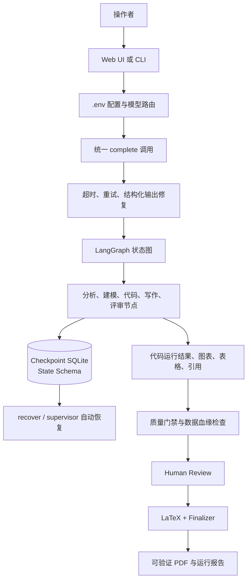
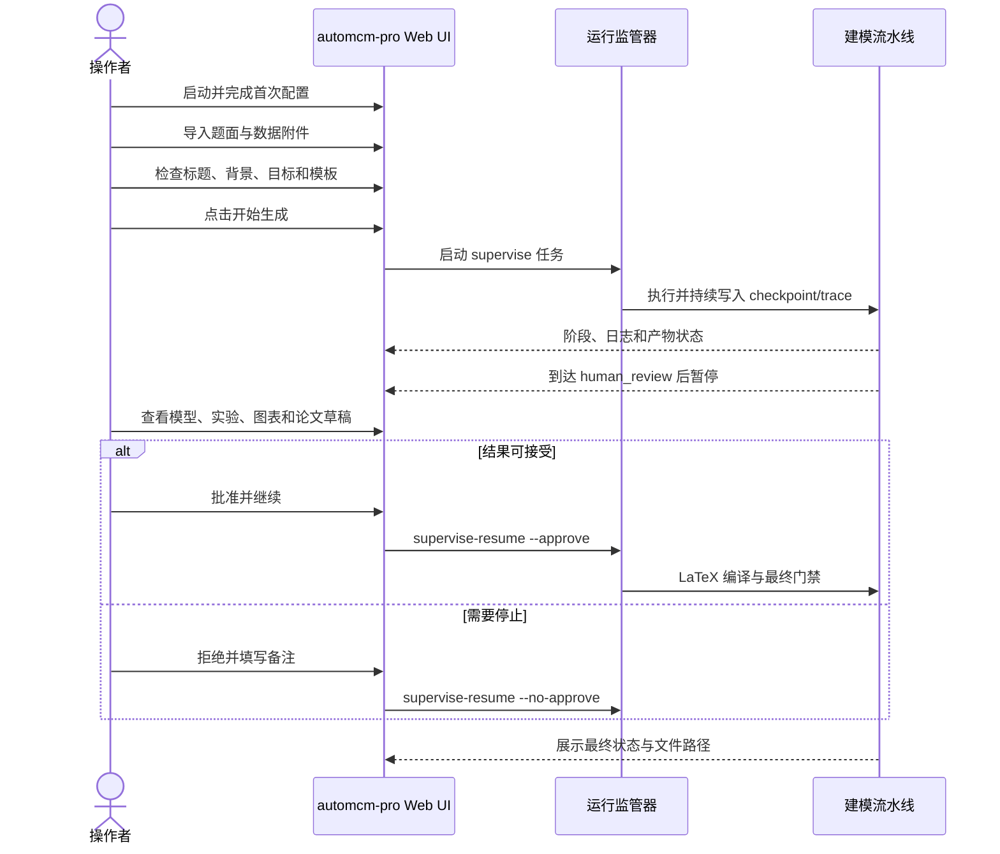

# automcm-pro 使用与原理

本文是当前实现的快速上手说明，面向第一次运行项目的操作者。历史文档中的 Beacon 仅作为历史名称保留，不代表当前产品名。

## 一、工作流程图

```mermaid
flowchart LR
    A[导入赛题与附件] --> B[Analyst 拆题]
    B --> C{Blueprint Critic}
    C -- 返工 --> B
    C -- 通过 --> D[Modeler 建模]
    D --> E{Model Critic}
    E -- 返工 --> D
    E -- 通过 --> F[Coder 实验代码]
    F --> G{Model-Code 一致性}
    G -- 返工 --> F
    G -- 通过 --> H[Sensitivity 参数敏感性]
    H --> I[Figure Pipeline 图表]
    I --> J[Writer 分章节写作]
    J --> K{Paper Critic}
    K -- 定向重写 --> J
    K -- 通过 --> L[Table Assembler 表格]
    L --> M[Evaluation 量化评价]
    M --> N{Human Review 人审}
    N -- 批准 --> O[LaTeX 编译与 Finalizer]
    N -- 拒绝 --> P[保留中间产物并结束]
    O --> Q[paper.md / paper.tex / PDF / trace]
```



## 二、原理图



核心机制是“状态图 + 证据 + 门禁”：每个节点读取结构化状态并写回结果；失败时从 checkpoint 恢复；模型、代码、图表和论文之间通过证据字段关联；只有人审批准且质量门禁通过，才会生成最终完成标记。LLM 访问统一经过 `complete()`，承担 provider 路由、超时、重试和 JSON 修复。

## 三、人类操作流程



## 安装与启动

前置条件：Windows 11/10、Node.js 18+、Python 3.11--3.13、`uv`，以及可访问的 OpenAI 兼容模型端点。

在项目根目录执行：

```powershell
npm install
uv sync
Copy-Item .env.example .env -Force
```

编辑 `.env`，至少填写：

```text
OPENAI_API_BASE=http://localhost:20128/v1
OPENAI_API_KEY=你的密钥
MATH_AGENT_DEFAULT_MODEL=openai/gpt-4o-mini
MATH_AGENT_STRONG_MODEL=openai/gpt-4o
```

然后启动 Web 工作台：

```powershell
npm start
```

浏览器打开 <http://127.0.0.1:5173>。首次进入按“环境检查 → 选择服务 → 填写密钥 → 验证模型 → 保存配置”完成引导。

## 接下来的操作步骤

1. 在 Web UI 导入题面，必要时上传 Excel/CSV/PDF/Word/TXT 数据附件。
2. 检查标题、背景、问题目标、模板和输出目录；第一次运行建议保留人工确认。
3. 点击“开始生成论文”，观察阶段进度和日志。
4. 流程暂停在人审时，打开模型假设、代码输出、图表、敏感性分析和论文草稿逐项检查。
5. 通过页面批准继续；若发现问题，拒绝并记录具体修改意见。
6. 完成后从输出目录查看 `paper.pdf`、`paper.tex`、`paper.md`、`trace.json` 和 `completion.json`。

也可以使用 CLI：

```powershell
uv run math-agent supervise --problem tests/fixtures/sample_problem.json --out runs/demo
uv run math-agent status --out runs/demo
uv run math-agent supervise-resume --out runs/demo --approve --notes "已检查模型和实验结果"
```

如果运行失败且存在 checkpoint：

```powershell
uv run math-agent supervise-recover --out runs/demo
```

## 验证安装

```powershell
uv run math-agent supervise --help
npm test
uv run --extra dev pytest -q
```

`uv run math-agent supervise --help` 能显示帮助、Node 测试通过且 Python 测试无阻断失败，才算本地安装验证完成。真实 LLM 运行还需要有效的 API 端点和密钥；没有它们只能验证界面、命令和 mock 测试。
